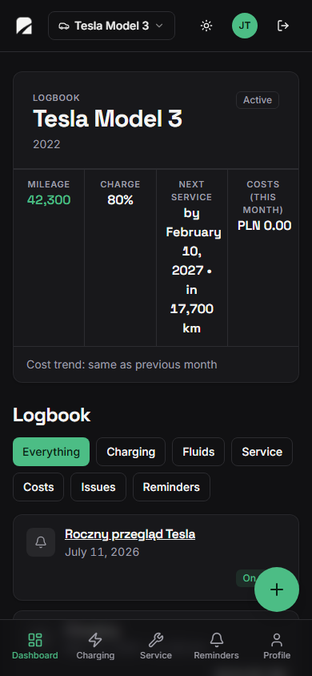
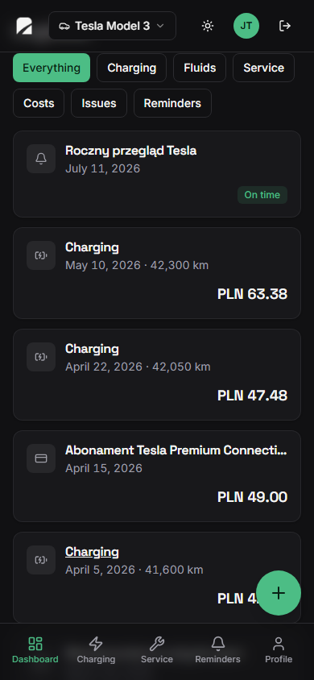
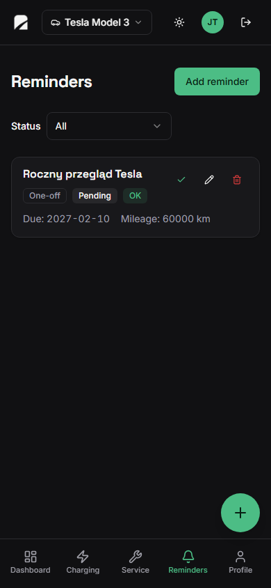
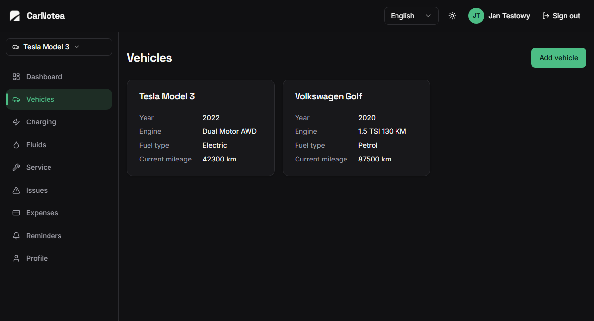
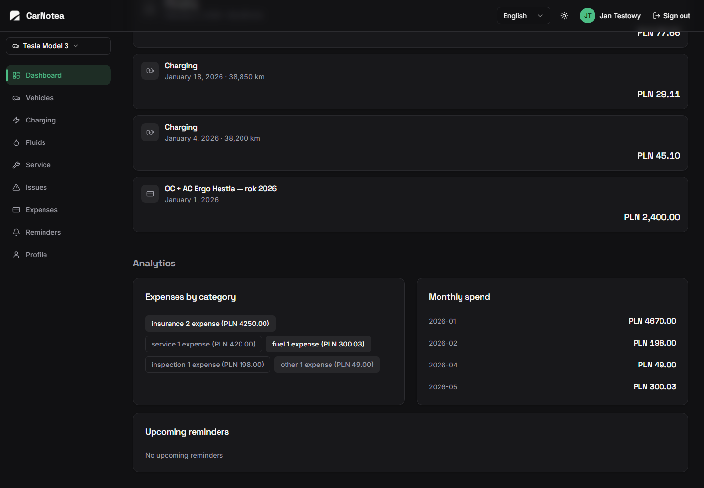

# 🚗 CarNotea

## 📋 Overview

CarNotea is a personal car diary for keeping refuels, charging, service, costs, issues, and important dates in one clear place.

## 🌐 Live App

Visit the app at **[carnotea.sergiusz.dev](https://carnotea.sergiusz.dev)**.

## 🖼️ Preview

  
  
  

  

  

 

## ✨ Features

- One timeline for refuels, charging, service, costs, issues, and reminders.
- Fuel entries with mileage, prices, and consumption tracking.
- Charging history with energy use, battery level, and costs for electric cars.
- Service records, repairs, parts, and workshops kept with the vehicle.
- Cost summaries that show where money goes.
- Reminders for inspections, insurance, service, and other dates worth remembering.
- Available in Polish and English on desktop and phone.
